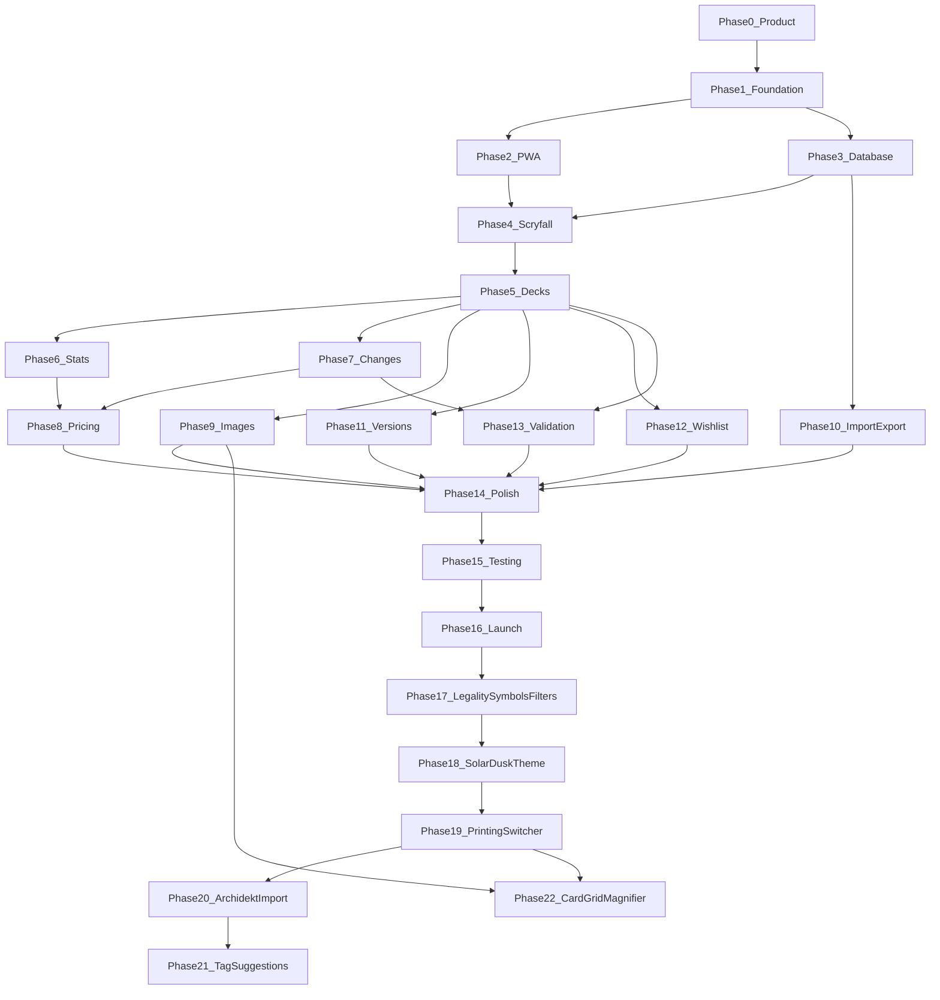

# MTG Deck Builder — Phase-by-Phase Build Plan

This folder contains **23 executable phase documents** (Phase 0–22) derived from the master product plan at [`plans/mtg-deck-builder-web-app-build-plan.md`](../plans/mtg-deck-builder-web-app-build-plan.md).

Phases 0–16 are the MVP build. **Phases 17–22 are post-launch improvement phases** and are optional for reaching v1.0.0. Phase 18 supersedes the Neo Brutalism visual-system decision after Phase 17 is complete. Phases 19–22 add printing choice, Archidekt-dialect import into existing decks, role/synergy *suggestions* (not silent auto-file), and card-shaped grid tiles with a magnifier.

Each phase is designed to be executed by a **new, independent agent** with no prior conversation context.

**Automation:** Every phase includes linting, testing, and CI tasks. See [`automation-strategy.md`](./automation-strategy.md) for the full toolchain (ESLint, Prettier, Knip, Vitest, TestCafe, GitHub Actions) and what to add per phase.

---

## How to Build Phase by Phase

1. Open the phase document for the phase you want to implement.
2. Start a **new Cursor agent** (fresh conversation).
3. Copy the entire **Agent Handoff Prompt** block from that phase doc and paste it as your first message.
4. Let the agent implement until all **Exit Criteria** are met.
5. Verify the **Testing Checklist** and **Automation & Quality Gates** before moving on.
6. Confirm **CI is green** (`lint`, `typecheck`, `test:unit` minimum) before starting the next phase.
7. Repeat with the next phase.

Do not skip phases — later phases assume earlier deliverables exist.

---

## Phase Index

| Phase | Document                                                                         | Summary                                              |
| ----- | -------------------------------------------------------------------------------- | ---------------------------------------------------- |
| 0     | [phase-00-product-definition.md](./phase-00-product-definition.md)               | Lock product model, MVP decisions, example deck spec |
| 1     | [phase-01-repository-foundation.md](./phase-01-repository-foundation.md)         | Next.js skeleton, Neo Brutalism theme, CI, Vercel    |
| 2     | [phase-02-pwa-foundation.md](./phase-02-pwa-foundation.md)                       | PWA manifest, service worker, iPhone install flow    |
| 3     | [phase-03-local-database.md](./phase-03-local-database.md)                       | Dexie schema, repositories, migrations, CRUD         |
| 4     | [phase-04-scryfall-integration.md](./phase-04-scryfall-integration.md)           | Scryfall client, card search, local cache            |
| 5     | [phase-05-deck-management.md](./phase-05-deck-management.md)                     | Deck CRUD, card list, status/roles/synergies         |
| 6     | [phase-06-deck-dashboard-statistics.md](./phase-06-deck-dashboard-statistics.md) | Mana curve, composition, deck warnings               |
| 7     | [phase-07-changes-upgrade-workflow.md](./phase-07-changes-upgrade-workflow.md)   | ADD/CUT/CONSIDER, projected deck, apply changes      |
| 8     | [phase-08-pricing.md](./phase-08-pricing.md)                                     | Pricing provider, deck valuation, TCGplayer links    |
| 9     | [phase-09-images-display-modes.md](./phase-09-images-display-modes.md)           | Card images, density modes, offline prefetch         |
| 10    | [phase-10-import-export-recovery.md](./phase-10-import-export-recovery.md)       | Backup/restore, data safety UX                       |
| 11    | [phase-11-versions-comparison.md](./phase-11-versions-comparison.md)             | Deck snapshots, version diff                         |
| 12    | [phase-12-wishlist.md](./phase-12-wishlist.md)                                   | Global wishlist, priority, deck targeting            |
| 13    | [phase-13-format-deck-validation.md](./phase-13-format-deck-validation.md)       | Commander rules, legality vs recommendations         |
| 14    | [phase-14-ux-polish.md](./phase-14-ux-polish.md)                                 | Transitions, skeletons, safe areas, polish           |
| 15    | [phase-15-testing-hardening.md](./phase-15-testing-hardening.md)                 | Unit, integration, E2E, iPhone QA                    |
| 16    | [phase-16-production-launch.md](./phase-16-production-launch.md)                 | Production deploy, launch checklist                  |
| 17    | [phase-17-legality-symbols-search-filters.md](./phase-17-legality-symbols-search-filters.md) | Legality tabs, mana symbols, search filters (v1.1) |
| 18    | [phase-18-solar-dusk-theme.md](./phase-18-solar-dusk-theme.md)                   | Solar Dusk migration, dark-default appearance        |
| 19    | [phase-19-printing-switcher.md](./phase-19-printing-switcher.md)                 | Switch printings, cheapest English paper print (v1.2) |
| 20    | [phase-20-archidekt-import.md](./phase-20-archidekt-import.md)                   | Archidekt-dialect parse, import into existing decks (v1.3) |
| 21    | [phase-21-role-synergy-suggestions.md](./phase-21-role-synergy-suggestions.md)   | Local role/synergy suggestions, overridable (v1.4) |
| 22    | [phase-22-card-grid-magnifier.md](./phase-22-card-grid-magnifier.md)             | Grid card tiles, art-dominant layout, magnifier (v1.5) |

---

## Phase Dependency Graph



Phases 6–7 can partially overlap after Phase 5. Phases 8–13 are largely parallelizable once Phase 5 is complete, but **Phase 14 (Polish) should wait for all feature phases**. Phase 22 depends on Phases 9, 18, and 19 only — it can be built before Phase 21.

---

## Recommended Build Order

```text
0 → 1 → 2 → 3 → 4 → 5 → 6 → 7 → 8 → 9 → 10 → 11 → 12 → 13 → 14 → 15 → 16 → 17 → 18 → 19 → 20 → 21 → 22
```

Phase 22 may be pulled ahead of Phase 21 (swap to `… → 20 → 22 → 21`) since it shares no files with tag suggestions.

**First milestone** (after Phase 7): Create decks locally, search Scryfall, mark ADD/CUT/CONSIDER, reopen app with data intact.

**MVP complete** (after Phase 16): Full Definition of Done workflow on iPhone against production URL.

**Phase 16 status (2026-08-19):** In-repo launch artifacts + production HTTPS URL ready; iPhone §70 / tag `v1.0.0` still human-blocked. See [`phase-16-production-launch.md`](./phase-16-production-launch.md).

**Phase 17 status (2026-08-19):** In-repo **v1.1.0** complete (legality tabs, mana symbols, search filters). See [`phase-17-legality-symbols-search-filters.md`](./phase-17-legality-symbols-search-filters.md).

**Phase 18 status (2026-08-19):** In-repo **v1.1.1** implementation complete (Solar Dusk migration, deterministic dark default, explicit light mode); physical iPhone appearance/cold-start sign-off remains. Completed Phase 0–17 documents retain Neo Brutalism references as historical implementation context.

**Phase 21 status (2026-08-20):** In-repo **v1.4.0** implementation complete (deterministic offline tag suggestions, suggest-on-add, and reviewed bulk apply with non-overwrite defaults). See ADR-026.

**Phase 22 status (2026-08-20):** In-repo **v1.5.0** implementation complete (grid tiles, zoom overlay, fine-pointer hover preview). See ADR-027–028.

---

## MVP Scope Summary

### In scope

- Multiple Commander decks, local-first IndexedDB storage
- PWA install on iPhone Home Screen
- Scryfall card search and metadata
- CURRENT / ADD / CUT / CONSIDER workflow
- Roles, synergies, projected deck, upgrade cost
- Pricing (Scryfall-first), TCGplayer links
- Import/export backups, deck versions, wishlist
- Basic Commander validation and the original Neo Brutalism launch theme (superseded post-launch by Phase 18)

### Explicitly out of scope

- User accounts, cloud sync, social sharing
- AI recommendations, full rules engine
- App Store native release

---

## Document Structure (every phase)

Each `phase-XX-*.md` file follows the same template:

- **Agent Handoff Prompt** — paste into a new agent
- **Overview / Goal / Prerequisites**
- **Architecture & Key Decisions**
- **File Structure** — exact paths to create/modify
- **Detailed Task List** — checkbox tasks with implementation notes
- **Testing Checklist / Exit Criteria**
- **Risks & Mitigations / Out of Scope**
- **Handoff to Next Phase**

---

## Key Architectural Principles

1. **Local-first** — IndexedDB/Dexie is the source of truth for decks; no backend DB in MVP.
2. **Repository layer** — UI never touches IndexedDB directly.
3. **One deck-card model** — statuses filter views; no separate add/cut tables.
4. **Provider-agnostic pricing** — TCGplayer links yes; TCGplayer API not required.
5. **Mobile-first iPhone** — bottom nav, bottom sheets, large tap targets.
6. **Phase-aware visual system** — Neo Brutalism governs Phases 0–17; Phase 18 supersedes it with tweakcn Solar Dusk and a deterministic dark default. All later phases must follow Phase 18.

---

## Quality & Automation

| Resource                                                                   | Description                                |
| -------------------------------------------------------------------------- | ------------------------------------------ |
| [automation-strategy.md](./automation-strategy.md)                         | Full toolchain, CI evolution, phase matrix |
| [checklists/iphone-safari-manual.md](./checklists/iphone-safari-manual.md) | Manual iPhone sign-off (Phase 15–16)       |

**Per-phase rule:** Add tests with the feature. Phase 15 hardens; it does not replace earlier test writing.

---

## References

- [Master build plan](../plans/mtg-deck-builder-web-app-build-plan.md)
- [Solar Dusk theme JSON](https://tweakcn.com/r/themes/solar-dusk.json) — active design system
- [Neo Brutalism theme JSON](https://tweakcn.com/r/themes/neo-brutalism.json) — historical launch reference
- [Next.js PWA Guide](https://nextjs.org/docs/app/guides/progressive-web-apps)
- [Scryfall API](https://scryfall.com/docs/api)
