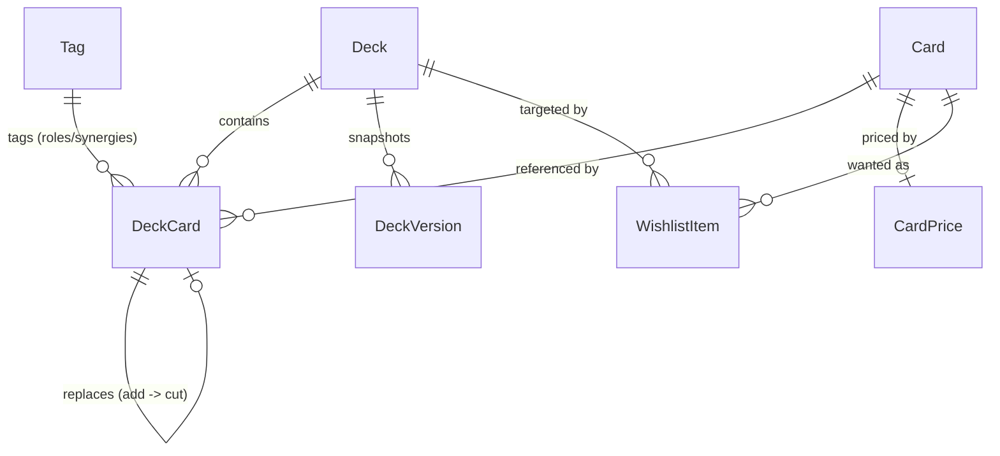

# MTG Deck Builder — Core Data Model

**Status:** LOCKED (Phase 0 output)
**Version:** 1.0
**Date:** 2026-08-18
**Authority:** This file is the single source of truth for entity shapes. Phase 3 implements the Dexie schema directly from it. Later phases that need a new field must add it here **and** add a migration note, rather than diverging locally.

Conventions used throughout:

- All ids are `string` UUIDs generated with `crypto.randomUUID()`, **except** `Card.id` / `Card.oracleId` (Scryfall UUIDs) and `Tag.id` (stable slug).
- All timestamps are **ISO 8601 UTC strings** (`new Date().toISOString()`), never `Date` objects and never epoch numbers. Rationale: structured-clone safe, human-readable in exports, sortable as strings.
- Optional (`?`) means "may be absent"; the app must not distinguish `undefined` from `null` — prefer omitting the key.
- Monetary values are `number` in major units (dollars, not cents), rounded for display only.

---

## 1. Enums and unions

```ts
/** Deck formats. Only `commander` is validated in the MVP; the rest are stubs. */
export type DeckFormat =
  | "commander"
  | "standard"
  | "modern"
  | "pioneer"
  | "legacy"
  | "vintage"
  | "pauper"
  | "other";

/** The four-state upgrade workflow. */
export type DeckCardStatus = "current" | "add" | "cut" | "consider";

/** Where a card sits within a deck. */
export type DeckCardZone =
  "commander" | "mainboard" | "sideboard" | "maybeboard";

/** Tag classification. */
export type TagCategory = "role" | "synergy" | "custom";

/** Wishlist urgency, ordered essential > high > medium > low. */
export type WishlistPriority = "essential" | "high" | "medium" | "low";

/** Supported display currencies. */
export type Currency = "USD" | "EUR";

/** Card list density. */
export type DisplayDensity = "compact" | "comfortable" | "image" | "grid";
```

`pauper` is included so Phase 5's enum does not have to widen the union later. Only `commander` has real rules in v1.0.

---

## 2. Deck

```ts
export interface Deck {
  id: string; // uuid
  name: string;
  format: DeckFormat;
  description?: string;
  /** Card.id (Scryfall printing) of the commander. Undefined until chosen. */
  commanderId?: string;
  createdAt: string; // ISO 8601
  updatedAt: string; // ISO 8601
  /** Most recently saved DeckVersion.id, if any. */
  activeVersionId?: string;
  archived?: boolean; // hidden from the default deck list
  favorite?: boolean; // pinned to the top of the deck list
}
```

`commanderId` references a **`Card.id` printing** in the shipped codebase. The corresponding `DeckCard` remains a normal row in the `commander` zone. Phase 19 preserves this established representation: switching that row updates `commanderId` from the old printing id to the new printing id.

---

## 3. DeckCard

The central entity. **One record per card-in-deck-per-zone.** There are no separate tables for adds, cuts, or considerations.

```ts
export interface DeckCard {
  id: string; // uuid
  deckId: string; // Deck.id
  cardId: string; // Card.id — the specific *printing*
  quantity: number; // >= 1
  zone: DeckCardZone;
  status: DeckCardStatus;
  foil?: boolean;
  owned?: boolean; // user already owns a physical copy
  notes?: string; // freeform, incl. reason for a CUT
  roles: string[]; // Tag.id values with category 'role' or 'custom'
  synergies: string[]; // Tag.id values with category 'synergy' or 'custom'
  /**
   * Upgrade relationship. Set on the ADD card, pointing at the CUT card it replaces.
   * Canonical direction: ADD -> CUT. The reverse (CUT -> ADD) is derived by lookup,
   * never stored, so the two sides cannot disagree.
   */
  replacesDeckCardId?: string; // DeckCard.id of a `cut` card in the same deck
  addedAt: string; // ISO 8601
  updatedAt: string; // ISO 8601
}
```

Invariants (enforced by the service layer, asserted by tests):

1. `quantity >= 1`. Removing a card deletes the record; it never goes to zero.
2. At most one `DeckCard` per `(deckId, cardId, zone, status)`.
3. `zone === 'commander'` implies `quantity === 1`.
4. `replacesDeckCardId` may only be set on a record whose `status === 'add'`, and may only point at a record in the same deck whose `status === 'cut'`.
5. `roles` and `synergies` contain no duplicates.

### 3.1 Resolved view type

Used by the stats and list layers, never persisted:

```ts
export interface DeckCardWithCard extends DeckCard {
  card: Card;
  price?: CardPrice;
}
```

---

## 4. Card

A cached Scryfall **printing**. Only cards the user has touched are stored.

```ts
export interface Card {
  /** Scryfall `id` — identifies one specific printing. Primary key. */
  id: string;
  /** Scryfall `oracle_id` — identifies the logical card across all printings. */
  oracleId: string;
  name: string;
  manaCost?: string; // e.g. '{2}{W}{W}'; absent for lands / some DFCs
  manaValue: number; // Scryfall `cmc`
  typeLine: string;
  oracleText?: string;
  colors: string[]; // e.g. ['W','R']
  colorIdentity: string[]; // e.g. ['W','U','B','R','G'] subset
  keywords: string[];
  setCode?: string;
  setName?: string;
  collectorNumber?: string;
  rarity?: string; // 'common' | 'uncommon' | 'rare' | 'mythic' | ...
  imageSmall?: string; // Scryfall image URI
  imageNormal?: string;
  imageLarge?: string;
  scryfallUri?: string; // human-facing Scryfall page
  tcgplayerUri?: string; // outbound purchase link, may be absent
  /** Format legality from Scryfall — `LegalityFormat` keys (Phase 17). */
  legalities?: Partial<Record<LegalityFormat, CardLegality>>;
  /** Faces of a double-faced / split / modal card. Absent for normal cards. */
  faces?: CardFace[];
  layout?: string; // Scryfall `layout`, e.g. 'transform', 'modal_dfc'
  updatedAt: string; // when this local copy was refreshed
}

/** Scryfall legality formats (superset of DeckFormat minus `other`). Phase 17. */
export type LegalityFormat =
  | "standard"
  | "future"
  | "historic"
  | "timeless"
  | "gladiator"
  | "pioneer"
  | "explorer"
  | "modern"
  | "legacy"
  | "pauper"
  | "vintage"
  | "penny"
  | "commander"
  | "oathbreaker"
  | "standardbrawl"
  | "brawl"
  | "alchemy"
  | "paupercommander"
  | "duel"
  | "oldschool"
  | "premodern"
  | "predh";

export type CardLegality = "legal" | "not_legal" | "banned" | "restricted";

export interface CardFace {
  name: string;
  manaCost?: string;
  typeLine?: string;
  oracleText?: string;
  imageSmall?: string;
  imageNormal?: string;
  imageLarge?: string;
}
```

**Identity rule (ADR-003):** deck cards, wishlist items, and prices all key on `Card.id` (the printing). `oracleId` is used for de-duplication ("you already run this card"), for Commander singleton validation, and for switching printings without losing the card's place in the deck. Phase 19 is the user-facing switcher: it updates `DeckCard.cardId` and upserts the new `Card` / `CardPrice` rows.

---

## 5. Tag

```ts
export interface Tag {
  /**
   * Stable slug, NOT a uuid: 'role.card-draw', 'synergy.go-wide',
   * 'custom.<uuid>' for user-created tags.
   */
  id: string;
  name: string; // display label, user-renameable
  category: TagCategory;
  color?: string; // optional theme token override
  /** True for the 26 roles + 23 synergies seeded on first run. */
  seeded?: boolean;
  /** Hidden from pickers without deleting historical references. */
  hidden?: boolean;
  sortOrder?: number;
}
```

Storing slugs rather than uuids means an exported backup and a plain-text CSV are both human-readable, and a re-seed on a fresh device reconnects existing deck cards to the same tags. `Other` sorts last. Custom tags use `custom.` + uuid so they can never collide with a future seeded slug.

The canonical seed lists (26 roles, 23 synergies) are in [`product-spec.md`](./product-spec.md) §5.

---

## 6. CardPrice

One cached price snapshot per printing per currency lookup. Keyed by `cardId` in v1.0 (single active currency at a time); if dual-currency caching is ever needed, Phase 8 must add a compound key via a migration.

```ts
export interface CardPrice {
  cardId: string; // Card.id (printing) — primary key
  currency: Currency;
  low?: number; // lowest observed / non-foil reference
  market?: number; // market / reference price
  normal?: number; // explicit non-foil price
  foil?: number; // foil price
  source: string; // 'scryfall'
  fetchedAt: string; // ISO 8601
}
```

Derived, never persisted:

```ts
export interface CardPriceView extends CardPrice {
  isStale: boolean; // fetchedAt older than the freshness window (24h)
  displayValue: number | null; // null => render "Price unavailable", never 0
}
```

**Hard rule:** absence of a price is `null` / `undefined`, never `0`. Totals report an unpriced-card count alongside the sum.

For Scryfall specifically: `normal` ← `prices.usd`/`prices.eur`, `foil` ← `prices.usd_foil`/`prices.eur_foil`, and `market` mirrors `normal` (Scryfall exposes a single reference price, not a spread). `low` is left undefined by `ScryfallPricingProvider`; it exists for providers that expose one.

```ts
export interface CardIdentity {
  cardId: string; // Card.id (printing)
  oracleId?: string;
  name: string;
  foil?: boolean;
}

export interface PricingProvider {
  readonly id: string;
  getPrice(card: CardIdentity): Promise<CardPrice | null>;
  getPrices(cards: CardIdentity[]): Promise<Map<string, CardPrice>>;
}
```

---

## 7. DeckVersion and DeckSnapshot

A version stores a **full snapshot**, not a delta, so restore can never depend on replaying history.

```ts
export interface DeckVersion {
  id: string; // uuid
  deckId: string;
  name: string; // 'v2 — Added stronger ramp'
  createdAt: string;
  snapshot: DeckSnapshot;
  notes?: string; // playtest notes
}

export interface DeckSnapshot {
  deck: Pick<Deck, "name" | "format" | "description" | "commanderId">;
  deckCards: DeckCardSnapshot[];
  capturedAt: string;
}

export interface DeckCardSnapshot {
  cardId: string;
  quantity: number;
  zone: DeckCardZone;
  status: DeckCardStatus;
  foil?: boolean;
  owned?: boolean;
  notes?: string;
  roles: string[];
  synergies: string[];
}
```

Snapshots deliberately omit `DeckCard.id`, `addedAt`, and `updatedAt`: restoring creates fresh records, so stale ids can never dangle. `snapshot.deck.commanderId` is resolved by matching the snapshot entry whose `zone === 'commander'`.

---

## 8. Wishlist

v1.0 has exactly one implicit wishlist, so only the item table exists. The `Wishlist` container from master plan §28 is defined here for forward compatibility but is **not** created as a Dexie table in Phase 3.

```ts
export interface WishlistItem {
  id: string; // uuid
  cardId: string; // Card.id
  quantity: number; // >= 1
  priority: WishlistPriority;
  targetDeckId?: string; // Deck.id, if earmarked for a specific deck
  targetRole?: string; // Tag.id of the role it is meant to fill
  notes?: string;
  addedAt: string;
  updatedAt: string;
  /** Reserved for a future multi-wishlist feature; unset in v1.0. */
  wishlistId?: string;
}

/** Post-MVP. Not persisted in v1.0. */
export interface Wishlist {
  id: string;
  name: string;
  createdAt: string;
  updatedAt: string;
}

export const WISHLIST_PRIORITY_ORDER: Record<WishlistPriority, number> = {
  essential: 0,
  high: 1,
  medium: 2,
  low: 3,
};
```

---

## 9. Settings and app metadata

```ts
export interface AppSetting {
  key: string; // primary key
  value: unknown;
  updatedAt: string;
}

export interface AppMeta {
  key: string; // primary key
  value: unknown;
  updatedAt: string;
}
```

Known setting keys (extend deliberately, document here):

| Key                      | Type                   | Default     | Owning phase |
| ------------------------ | ---------------------- | ----------- | ------------ |
| `imagesEnabled`          | `boolean`              | `true`      | 9            |
| `densityMode`            | `DisplayDensity`       | `'comfortable'` | 9 / 22    |
| `currency`               | `Currency`             | `'USD'`     | 8            |
| `priceFreshnessHours`    | `number`               | `24`        | 8            |
| `lastBackupAt`           | `string \| null`       | `null`      | 10           |
| `installBannerDismissed` | `boolean`              | `false`     | 2            |
| `activeDeckId`           | `string \| null`       | `null`      | 5            |
| `recommendationConfig`   | `RecommendationConfig` | see §11     | 13           |
| `searchFilters`          | `CardSearchFilters \| null` | `null` | 17           |
| `tags.suggestOnAdd`      | `boolean`              | `true`      | 21           |
| `cardZoom.hoverPreview`  | `boolean`              | `true`      | 22           |
| `cardZoom.tapImageOpensZoom` | `boolean`          | `true`      | 22           |

Known appMeta keys: `schemaVersion` (number), `firstRunAt` (ISO string), `tagsSeededVersion` (number).

A typed accessor is preferred over raw key strings:

```ts
export interface AppSettings {
  imagesEnabled: boolean;
  densityMode: DisplayDensity;
  currency: Currency;
  priceFreshnessHours: number;
  lastBackupAt: string | null;
  installBannerDismissed: boolean;
  activeDeckId: string | null;
  recommendationConfig: RecommendationConfig;
  searchFilters: CardSearchFilters | null;
  /** Prefill empty role/synergy arrays from local heuristics on add. Phase 21. */
  "tags.suggestOnAdd": boolean;
  /** Fine-pointer hover preview of card art. Phase 22. */
  "cardZoom.hoverPreview": boolean;
  /** Tap list thumbnails to open the zoom overlay. Phase 22. */
  "cardZoom.tapImageOpensZoom": boolean;
}

/** Cached Scryfall symbology (Dexie `symbols` table) — Phase 17. Not in backups. */
export interface MtgSymbol {
  symbol: string;
  svgUri: string;
  english: string;
  representsMana: boolean;
  colors: string[];
  updatedAt: string;
}
```

---

## 10. Derived / computed types (not persisted)

### 10.1 Change summary and apply result — Phase 7

```ts
export interface DeckChangeSummary {
  addCount: number; // distinct DeckCards with status 'add'
  addQuantity: number; // summed quantity
  cutCount: number;
  cutQuantity: number;
  considerCount: number;
  hasPendingChanges: boolean; // addCount + cutCount > 0
  currentSize: number; // Σ quantity where status in {current, cut}
  projectedSize: number; // currentSize - cutQuantity + addQuantity
  upgradeCost: DeckCostSummary;
}

export interface DeckCostSummary {
  currency: Currency;
  total: number; // sum over priced cards only
  pricedCards: number;
  unpricedCards: number; // surfaced in the UI; never counted as 0
  oldestFetchedAt: string | null;
  source: string | null;
}

export interface ApplyChangesResult {
  promotedCount: number; // add -> current
  removedCount: number; // cut -> deleted
  appliedAt: string;
  errors?: string[];
}
```

### 10.2 Statistics — Phase 6

```ts
export interface DeckStats {
  counts: DeckCountStats;
  manaCurve: ManaCurve;
  typeDistribution: DistributionItem[];
  colorDistribution: DistributionItem[];
  roleDistribution: DistributionItem[];
  synergyDistribution: DistributionItem[];
  statusCounts: StatusCounts;
  manaSources: number;
  averageManaValue: number; // excludes lands
}

export interface DeckCountStats {
  current: number;
  projected: number;
  lands: number;
  creatures: number;
  nonCreatures: number;
  target: number; // 100 for commander
}

/** mana value -> summed quantity. Values >= 7 are bucketed under key 7. */
export type ManaCurve = Record<number, number>;

export interface DistributionItem {
  key: string; // type name, colour letter, or Tag.id
  label: string;
  count: number;
}

export interface StatusCounts {
  current: number;
  add: number;
  cut: number;
  consider: number;
}
```

### 10.3 Version diff — Phase 11

```ts
export interface VersionDiff {
  added: DiffEntry[];
  removed: DiffEntry[];
  quantityChanges: QuantityChangeEntry[];
  statusChanges: StatusChangeEntry[];
  summary: { addedCount: number; removedCount: number; changedCount: number };
}

export interface DiffEntry {
  cardId: string;
  name: string;
  zone: DeckCardZone;
  quantity: number;
  status?: DeckCardStatus;
}

export interface QuantityChangeEntry {
  cardId: string;
  name: string;
  from: number;
  to: number;
}

export interface StatusChangeEntry {
  cardId: string;
  name: string;
  from: DeckCardStatus;
  to: DeckCardStatus;
}
```

---

## 11. Validation — Phase 13

Legality and recommendation are **separate concerns** and must never be rendered as the same kind of statement.

```ts
export type WarningCategory = "legality" | "recommendation" | "integrity";
export type WarningSeverity = "error" | "warn" | "info" | "success";

export interface DeckWarning {
  id: string;
  category: WarningCategory;
  severity: WarningSeverity;
  code: string; // 'COMMANDER_COUNT', 'DUPLICATE_NON_BASIC', ...
  message: string;
  details?: string;
  cardIds?: string[];
  field?: string;
  actual?: number;
  expected?: number;
}

export interface FormatRules {
  readonly format: DeckFormat;
  getDeckWarnings(input: DeckValidationInput): DeckWarning[];
}

export interface DeckValidationInput {
  deck: Deck;
  commander: DeckCardWithCard | null;
  mainboard: DeckCardWithCard[];
  sideboard: DeckCardWithCard[];
  totalCount: number;
  config: RecommendationConfig;
}

export interface RecommendationConfig {
  minLands: number; // default 33
  maxLands: number; // default 40
  minRamp: number; // default 8
  minCardDraw: number; // default 8
  minRemoval: number; // default 5
  maxAverageManaValue?: number; // default 3.5
}
```

`category` answers "is this a rule or an opinion?"; `severity` answers "how loudly do we say it?". Phase 6 surfaces the same `DeckWarning` type in the dashboard; it must not define a competing shape.

---

## 12. Backup formats — Phases 3 and 10

```ts
export interface AppBackup {
  backupVersion: 1; // bump only on breaking backup-schema changes
  appSchemaVersion: number; // Dexie version at export time
  exportedAt: string;
  exportedFrom: { appVersion: string; userAgent?: string };
  metadata: { deckCount: number; cardCount: number; wishlistCount: number };
  data: {
    decks: Deck[];
    deckCards: DeckCard[];
    deckVersions: DeckVersion[];
    cards: Card[];
    cardPrices: CardPrice[];
    tags: Tag[];
    wishlistItems: WishlistItem[];
    settings: AppSetting[];
  };
}

export interface DeckExport {
  exportVersion: 1;
  exportedAt: string;
  deck: Deck;
  deckCards: DeckCard[];
  cards: Card[]; // only the printings referenced above
  tags: Tag[]; // only the tags referenced above
}
```

Backups never contain image binaries. Import must reject an unrecognised `backupVersion` with an explicit message rather than attempting a best-effort parse.

---

## 13. Persistence mapping (Dexie v1)

Phase 3 must create exactly these tables and indexes. Once shipped, **version 1 is never edited in place** — all changes go through `this.version(n).stores(...).upgrade(...)`.

```ts
this.version(1).stores({
  cards: "id, oracleId, name, updatedAt",
  cardPrices: "cardId, fetchedAt",
  decks: "id, name, format, updatedAt, createdAt",
  deckCards: "id, deckId, cardId, status, [deckId+status], [deckId+zone]",
  deckVersions: "id, deckId, createdAt",
  tags: "id, category, name",
  wishlistItems: "id, cardId, priority, targetDeckId",
  settings: "key",
  appMeta: "key",
});
```

| Table           | Entity         | Primary key              |
| --------------- | -------------- | ------------------------ |
| `cards`         | `Card`         | `id` (Scryfall printing) |
| `cardPrices`    | `CardPrice`    | `cardId`                 |
| `decks`         | `Deck`         | `id`                     |
| `deckCards`     | `DeckCard`     | `id`                     |
| `deckVersions`  | `DeckVersion`  | `id`                     |
| `tags`          | `Tag`          | `id` (slug)              |
| `wishlistItems` | `WishlistItem` | `id`                     |
| `settings`      | `AppSetting`   | `key`                    |
| `appMeta`       | `AppMeta`      | `key`                    |
| `symbols`       | `MtgSymbol`    | `symbol` (Phase 17; cache only) |

`setMetadata` from master plan §28 is **not** created in v1.0 — nothing in the MVP reads set-level metadata beyond what is denormalised onto `Card`. Add it in a later Dexie version if needed.

Schema **v5** adds `symbols: "symbol, updatedAt"` for Scryfall symbology. It is rebuildable from the network and **must not** appear in `AppBackup` export/import.

Access rule (mandatory, from master plan §2): UI → hooks → services → repositories → Dexie. No component or page may reference `db.<table>` directly.

---

## 14. Entity relationships



---

## 15. Change log

| Version | Date       | Change                  |
| ------- | ---------- | ----------------------- |
| 1.0     | 2026-08-18 | Initial lock (Phase 0). |
