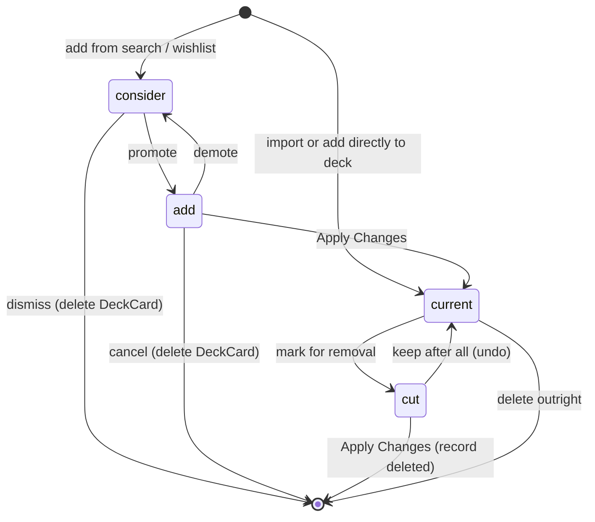

# MTG Deck Builder — MVP Product Specification

**Status:** LOCKED (Phase 0 output)
**Version:** 1.0
**Date:** 2026-08-18
**Supersedes:** nothing. **Derived from:** [`plans/mtg-deck-builder-web-app-build-plan.md`](../plans/mtg-deck-builder-web-app-build-plan.md)

This document is the **source of truth** for what the MVP is. Phases 1–16 must not add scope that is not listed here, and must not silently drop scope that is listed here. Data shapes live in [`data-model.md`](./data-model.md); rationale and trade-offs live in [`decisions.md`](./decisions.md); the reference fixture lives in [`example-deck-soldier-swarm.md`](./example-deck-soldier-swarm.md).

---

## 1. Product identity

**App name:** MTG Deck Builder
**Short name (PWA / Home Screen):** Deck Builder
**Tagline:** Track what's in your deck, what's going in, and what it costs.

### Vision

MTG Deck Builder is a mobile-first, local-first Progressive Web App for a single Magic: The Gathering player who maintains several Commander decks and upgrades them continuously. Instead of juggling a spreadsheet of "cards I want to add" and "cards I want to cut", the user keeps one deck record per deck in which every card carries a status — CURRENT, ADD, CUT, or CONSIDER — plus multi-valued role and synergy tags. From that single model the app derives the current deck, the projected deck, the shopping list, and the upgrade cost. All deck data lives in IndexedDB on the device, requires no account, survives being offline, and can be exported to a JSON backup at any time. Card metadata, images, and reference prices come from Scryfall; TCGplayer is linked to for purchasing but is never a runtime dependency.

### Target platform

| Aspect                    | Decision                                                                               |
| ------------------------- | -------------------------------------------------------------------------------------- |
| Primary device            | iPhone, Safari, **portrait** orientation                                               |
| Install mode              | Add to Home Screen → `display: standalone`                                             |
| Secondary device          | Desktop browsers — an _enhancement_, never the design driver                           |
| Minimum design viewport   | 375 × 667 CSS px (iPhone SE)                                                           |
| Reference design viewport | 390 × 844 CSS px (iPhone 14/15)                                                        |
| Hosting                   | Vercel (preview per PR, production from `main`)                                        |
| Transport                 | HTTPS only (required for service worker)                                               |
| Backend                   | None for deck data. Vercel server routes only if a price provider ever needs a secret. |

---

## 2. MVP scope

### 2.1 In scope (from master plan §63)

Every item below must exist in the v1.0 release. The phase that owns it is listed for traceability.

| #    | Feature                                                                  | Owning phase |
| ---- | ------------------------------------------------------------------------ | ------------ |
| S-01 | Multiple decks, unlimited (storage permitting)                           | 5            |
| S-02 | Commander format support (validation + 100-card model)                   | 5, 13        |
| S-03 | Local-first storage — device is the source of truth                      | 3            |
| S-04 | IndexedDB via Dexie, with versioned migrations from v1                   | 3            |
| S-05 | PWA installation to iPhone Home Screen, standalone launch                | 2            |
| S-06 | Offline deck editing (create/edit/status/tags with no network)           | 2, 3         |
| S-07 | Scryfall card search                                                     | 4            |
| S-08 | Card metadata (mana cost, type line, oracle text, set, rarity, legality) | 4            |
| S-09 | Card images from Scryfall URLs                                           | 9            |
| S-10 | CURRENT / ADD / CUT / CONSIDER statuses on one deck-card model           | 5, 7         |
| S-11 | Roles — multi-select, 26-entry catalog, user-editable                    | 5            |
| S-12 | Synergies — multi-select, 23-entry catalog, custom tags allowed          | 5            |
| S-13 | "Need to Add" list with quantities and totals                            | 7            |
| S-14 | "Cards to Cut" list with reasons and replacement links                   | 7            |
| S-15 | Projected deck = CURRENT + ADD − CUT                                     | 7            |
| S-16 | Upgrade cost calculation                                                 | 7, 8         |
| S-17 | TCGplayer outbound links per card                                        | 8            |
| S-18 | Price caching with source + timestamp, never `$0.00` on failure          | 8            |
| S-19 | Import / export (full JSON backup, single-deck JSON, text list, CSV)     | 10           |
| S-20 | Deck duplication                                                         | 5            |
| S-21 | Deck versions (full snapshots) and version comparison                    | 11           |
| S-22 | Global wishlist with priority and optional target deck                   | 12           |
| S-23 | Basic Commander validation, split into legality vs recommendation        | 13           |
| S-24 | tweakcn Solar Dusk, deterministic dark default, explicit light mode       | 18           |
| S-25 | Vercel deployment with preview + production                              | 1, 16        |
| S-26 | Image on/off toggle and compact / comfortable / image density modes      | 9            |
| S-27 | Deck statistics: mana curve, type, color, role, synergy, land count      | 6            |
| S-28 | Data-safety UX: last backup timestamp, guarded destructive reset         | 10           |
| S-29 | Switch card printing; cheapest English paper printing (previewed bulk)   | 19           |
| S-30 | Archidekt-dialect text import into an existing deck (previewed)          | 20           |
| S-31 | Overridable role/synergy *suggestions* from local heuristics             | 21           |

### 2.2 Explicitly out of scope for v1.0 (from master plan §63)

These must be actively refused during implementation. Requests for them are post-MVP.

- User accounts, authentication, login of any kind
- Cloud synchronization or cross-device sync
- Social sharing, public deck profiles, shareable deck links
- Multiplayer or collaborative editing
- AI deck recommendations, automated optimization, synergy scoring
- A full MTG rules engine
- Native App Store release
- Authenticated TCGplayer API pricing (links only)
- Price history charts and wishlist price alerts
- Bulk download of the entire Scryfall card or image database
- Silent, non-overridable auto-filing of roles/synergies (suggestions are Phase 21)
- Archidekt/Moxfield/EDHREC account scrape or unpublished crowd category tables

Post-v1.0 phases cover a **text dialect** for Archidekt exports (Phase 20) and **suggestions** for roles/synergies (Phase 21). They do not restore the v1.0 ban on AI or on bulk Scryfall downloads.

### 2.3 Scope-change rule

Any addition to §2.1 or removal from §2.2 requires a new ADR appended to [`decisions.md`](./decisions.md). Phase agents may not expand scope unilaterally.

---

## 3. Definition of Done (acceptance narrative)

Adapted from master plan §70. The product is done when this flow works on a physical iPhone, from the Home Screen icon, against the production URL.

```text
Open app from Home Screen
        ↓
Select "Soldier Swarm"
        ↓
View current deck
        ↓
Toggle card images off
        ↓
Search "soldier"
        ↓
Open a card
        ↓
See image + metadata + price
        ↓
Mark card CONSIDER
        ↓
Assign Soldier + Token tags
        ↓
Promote to ADD
        ↓
Mark an existing card CUT
        ↓
Open "Need to Add"
        ↓
See total upgrade price
        ↓
Open TCGplayer link
        ↓
Apply changes
        ↓
Save version
        ↓
Close app
        ↓
Reopen from Home Screen
        ↓
Everything remains
```

### 3.1 Definition of Done mapped to numbered test cases

Phase 15 must implement **E2E-01 … E2E-08** as automated TestCafe journeys and **MAN-01 … MAN-04** as manual iPhone checks. Each row states the observable assertion so no interpretation is needed later.

| ID         | Journey                  | Automated?                 | Assertion                                                                                                                                                                                              | Phase introduced      |
| ---------- | ------------------------ | -------------------------- | ------------------------------------------------------------------------------------------------------------------------------------------------------------------------------------------------------ | --------------------- |
| **E2E-01** | create-deck              | Yes                        | Create a Commander deck named "Soldier Swarm", set commander, add ≥1 card, reload the page → deck and cards still present with identical counts.                                                       | 5 (smoke) → 15 (full) |
| **E2E-02** | card-search              | Yes (MSW-mocked Scryfall)  | Type "soldier" in card search → results render; tap a result → detail sheet shows image, mana cost, type line, oracle text, price block; "Add to deck" writes a `DeckCard`.                            | 15                    |
| **E2E-03** | consider-to-add          | Yes                        | Mark a searched card CONSIDER, assign roles + synergies, promote to ADD → card appears in "Need to Add" with the tags intact.                                                                          | 15                    |
| **E2E-04** | mark-cut                 | Yes                        | Mark an existing CURRENT card CUT → it leaves the CURRENT view, appears in "Cards to Cut", and the projected count decreases by its quantity.                                                          | 15                    |
| **E2E-05** | upgrade-cost             | Yes (fixed price fixtures) | "Need to Add" shows card count, total quantity, an estimated total, the price source, and a fetched-at timestamp. With prices deliberately unavailable, it shows "Price unavailable" and never `0.00`. | 15                    |
| **E2E-06** | apply-changes            | Yes                        | Apply Changes → every ADD becomes CURRENT, every CUT is removed from the deck, ADD/CUT lists are empty, and the projected count from E2E-04 equals the new current count.                              | 15                    |
| **E2E-07** | save-and-compare-version | Yes                        | Save a version before and after applying changes → version list has both; diff shows the applied ADDs under "Added" and the applied CUTs under "Removed".                                              | 15                    |
| **E2E-08** | export-import            | Yes                        | Export full backup → clear all data → import the backup → deck, deck cards, tags, versions, and wishlist are restored identically.                                                                     | 15                    |
| **E2E-09** | wishlist-flow            | Yes                        | Add a card to the wishlist with priority Essential, then promote it to CONSIDER on a target deck → the wishlist item is resolved and the deck card exists.                                             | 15                    |
| **E2E-10** | offline-edit             | Yes                        | Go offline → edit a deck (rename, change a status) → reload → changes persisted; offline indicator visible; no data loss.                                                                              | 15                    |
| **MAN-01** | Home Screen install      | No                         | Safari → Share → Add to Home Screen → icon appears; launching shows no Safari browser chrome.                                                                                                          | 2 (checklist) → 16    |
| **MAN-02** | Standalone persistence   | No                         | Create a deck in the installed app, fully close the app, reopen from Home Screen → deck intact. **Highest-priority test in the project.**                                                              | 15                    |
| **MAN-03** | Safe areas & tap targets | No                         | Bottom nav is not obscured by the home indicator; all primary controls ≥ 44 × 44 px.                                                                                                                   | 14                    |
| **MAN-04** | External links           | No                         | TCGplayer link opens in the external browser and returns cleanly to the app.                                                                                                                           | 16                    |

The manual checklist lives at [`build-plan/checklists/iphone-safari-manual.md`](../build-plan/checklists/iphone-safari-manual.md).

---

## 4. Deck status model

### 4.1 The four statuses

| Status     | Meaning                                                        | Counts toward current deck? | Counts toward projected deck? |
| ---------- | -------------------------------------------------------------- | --------------------------- | ----------------------------- |
| `current`  | Physically in the deck right now.                              | Yes                         | Yes (unless also cut)         |
| `add`      | Committed to going in at the next update. Not in the deck yet. | No                          | Yes                           |
| `cut`      | Physically in the deck now, but targeted for removal.          | Yes                         | No                            |
| `consider` | Being evaluated. No commitment. Not in the deck.               | No                          | No                            |

`consider` is deliberately excluded from the projected deck — it is a shortlist, not a plan.

### 4.2 State transitions



Allowed transitions are exactly the arrows above. Any status may be set directly by the user from the card row action sheet; the diagram documents the _intended_ workflow, not a hard state machine that blocks other moves.

### 4.3 Derived views, not separate tables

**Mandatory.** There is exactly one `DeckCard` record per card-in-deck-per-zone. There is no `addedCards` table, no `cutCards` table, no `considerList` table. Every screen below is a filter over `deckCards where deckId = X`:

| Screen               | Filter                                                      |
| -------------------- | ----------------------------------------------------------- |
| Deck cards (current) | `status = 'current' OR status = 'cut'` (cuts shown flagged) |
| Need to Add          | `status = 'add'`                                            |
| Cards to Cut         | `status = 'cut'`                                            |
| Considering          | `status = 'consider'`                                       |
| Projected deck       | `status IN ('current','add') AND status != 'cut'`           |

Projected deck size = `Σ quantity where status ∈ {current, add}` − `Σ quantity where status = 'cut'`.

### 4.4 Apply Changes

"Apply Changes" is the single commit point of the upgrade workflow. It must run in one atomic IndexedDB transaction.

1. Every `DeckCard` with `status = 'add'` → `status = 'current'`; `updatedAt` refreshed.
2. Every `DeckCard` with `status = 'cut'` → **record deleted** from `deckCards`.
3. Every `DeckCard` with `status = 'consider'` → **left untouched**. Considering is not part of the commit.
4. `replacesDeckCardId` links pointing at deleted CUT records are cleared (set to `undefined`).
5. `deck.updatedAt` refreshed.
6. The user is shown a confirmation summary _before_ the transaction, listing counts and cost, and an undo affordance _after_ it (Phase 14 snackbar) for the length of one session action.
7. The user is prompted — not forced — to save a deck version immediately after applying.

Result shape: `ApplyChangesResult { promotedCount, removedCount, appliedAt, errors? }`.

---

## 5. Roles and synergies

### 5.1 Behaviour rules

- Both roles and synergies are **multi-valued**: a card may carry any number of each.
- Both are stored on `DeckCard`, not on `Card` — the same card can play a different role in a different deck.
- Both are stored as **stable tag ids** (see [`data-model.md`](./data-model.md) §5), not free display strings.
- The catalogs below are **seeded defaults**. The user may create custom tags (`Tag.category = 'custom'`) and may rename or hide seeded ones.
- **Suggestions (Phase 21), never silent classification.** Heuristics may pre-fill empty tag arrays and a bulk "Suggest tags" preview may apply to untagged cards. The user can always remove or replace tags. The app does not clone Archidekt's crowd categories or EDHREC synergy scores (ADR-026).
- Filtering, grouping, and the role/synergy distribution widgets all read these tags.

### 5.2 Role catalog — 26 entries (locked)

| #   | Role             | Tag id                  |
| --- | ---------------- | ----------------------- |
| 1   | Ramp             | `role.ramp`             |
| 2   | Card Draw        | `role.card-draw`        |
| 3   | Card Selection   | `role.card-selection`   |
| 4   | Removal          | `role.removal`          |
| 5   | Board Wipe       | `role.board-wipe`       |
| 6   | Protection       | `role.protection`       |
| 7   | Interaction      | `role.interaction`      |
| 8   | Counterspell     | `role.counterspell`     |
| 9   | Anthem           | `role.anthem`           |
| 10  | Token Generator  | `role.token-generator`  |
| 11  | Token Payoff     | `role.token-payoff`     |
| 12  | Recursion        | `role.recursion`        |
| 13  | Tutor            | `role.tutor`            |
| 14  | Cost Reduction   | `role.cost-reduction`   |
| 15  | Mana Fixing      | `role.mana-fixing`      |
| 16  | Sacrifice Outlet | `role.sacrifice-outlet` |
| 17  | Graveyard Hate   | `role.graveyard-hate`   |
| 18  | Pillowfort       | `role.pillowfort`       |
| 19  | Life Gain        | `role.life-gain`        |
| 20  | Voltron          | `role.voltron`          |
| 21  | Win Condition    | `role.win-condition`    |
| 22  | Finisher         | `role.finisher`         |
| 23  | Utility          | `role.utility`          |
| 24  | Combo Piece      | `role.combo-piece`      |
| 25  | Evasion          | `role.evasion`          |
| 26  | Other            | `role.other`            |

> Master plan §12 lists 25 roles; the phase brief requires 26. **Evasion** was added — see ADR-014. `Other` is always sorted last in pickers.

### 5.3 Synergy catalog — 23 entries (locked)

| #   | Synergy       | Tag id                     |
| --- | ------------- | -------------------------- |
| 1   | Soldier       | `synergy.soldier`          |
| 2   | Human         | `synergy.human`            |
| 3   | Warrior       | `synergy.warrior`          |
| 4   | Knight        | `synergy.knight`           |
| 5   | Token         | `synergy.token`            |
| 6   | Go-Wide       | `synergy.go-wide`          |
| 7   | +1/+1 Counter | `synergy.plus-one-counter` |
| 8   | Equipment     | `synergy.equipment`        |
| 9   | Artifact      | `synergy.artifact`         |
| 10  | Enchantment   | `synergy.enchantment`      |
| 11  | ETB           | `synergy.etb`              |
| 12  | Death Trigger | `synergy.death-trigger`    |
| 13  | Sacrifice     | `synergy.sacrifice`        |
| 14  | Graveyard     | `synergy.graveyard`        |
| 15  | Combat        | `synergy.combat`           |
| 16  | Aggro         | `synergy.aggro`            |
| 17  | Control       | `synergy.control`          |
| 18  | Midrange      | `synergy.midrange`         |
| 19  | Tribal        | `synergy.tribal`           |
| 20  | Protection    | `synergy.protection`       |
| 21  | Blink         | `synergy.blink`            |
| 22  | Reanimation   | `synergy.reanimation`      |
| 23  | Spells Matter | `synergy.spells-matter`    |

`role.protection` and `synergy.protection` are distinct tags with the same display name; the id prefix disambiguates them and pickers are scoped by category, so the user never sees both in one list.

---

## 6. Pricing strategy

### 6.1 Provider abstraction

Pricing is behind an interface from day one so the price source can be swapped without touching deck logic:

```ts
interface PricingProvider {
  readonly id: string; // 'scryfall'
  getPrice(card: CardIdentity): Promise<CardPrice | null>;
  getPrices(cards: CardIdentity[]): Promise<Map<string, CardPrice>>;
}
```

- **First and only v1.0 implementation:** `ScryfallPricingProvider`, reading `prices.usd` / `prices.eur` / `prices.usd_foil` from the Scryfall card object already fetched for metadata. No extra API surface, no key, no rate-limit cost.
- Prices are cached in the `cardPrices` table keyed by printing id, with `source` and `fetchedAt`.
- Deck valuation and upgrade cost are computed from cached snapshots, never from a blocking live request.

### 6.2 TCGplayer

- **Links only.** Every card that has a `tcgplayerUri` from Scryfall renders a `View on TCGplayer ↗` action that opens externally (`target="_blank" rel="noopener noreferrer"`).
- No TCGplayer API integration, no credentials, no browser-side scraping. The app must remain fully functional if every TCGplayer link is missing.

### 6.3 Currency

Default **USD**. EUR is selectable in Settings and is read from Scryfall's `prices.eur`. Totals never mix currencies — if a card lacks a price in the selected currency it is counted as _unpriced_, not as zero, and the total is labelled accordingly.

### 6.4 Freshness and failure UX (mandatory)

Never display `$0.00` because a price lookup failed. Required states:

| Situation                             | Display                                                 |
| ------------------------------------- | ------------------------------------------------------- |
| Fresh price (< 24 h)                  | `$4.21 · Scryfall · Updated 3h ago`                     |
| Stale price (≥ 24 h)                  | `$4.21 · Scryfall · Updated 6d ago` with a stale marker |
| No price ever fetched                 | `Price unavailable`                                     |
| Fetch failed, cached value exists     | `Price unavailable — Last known: $4.21 (6d ago)`        |
| Card genuinely has no price at source | `No price at source`                                    |

Deck and upgrade totals must state how many cards are unpriced, e.g. `Estimated: $37.42 · 3 cards unpriced`.

---

## 7. Card data policy

- **Scryfall is the sole card metadata source.** No proprietary card database, no second source, no manual card entry beyond user notes.
- Only cards the user actually touches are persisted locally (search results that get added, deck cards, wishlist cards). Bulk download of Scryfall data is out of scope.
- **Image URLs** are cached in IndexedDB; **image bytes** are not. Image binaries are cached by the service worker / browser HTTP cache, with an opt-in "Download deck images for offline use" action for the active deck only (Phase 9).
- **Rate limiting:** sequential requests are throttled to **≥ 100 ms apart** (Scryfall asks for 50–100 ms; we take the conservative end), with exponential backoff and retry on 429/5xx. Search input is debounced at 300 ms.
- **Identity:** `Card.id` is the Scryfall **printing** id; `Card.oracleId` is the Scryfall `oracle_id`. Deck cards reference the printing. See ADR-003.
- **Attribution:** the Settings → About screen credits Scryfall and states that card data and images are unofficial Fan Content / Scryfall-sourced.
- **Never hit the real Scryfall API from tests or CI.** MSW fixtures from Phase 4 onward.

---

## 8. Import / export formats

Backups are a first-class feature, not a nice-to-have, because the data is local-only.

### 8.1 Full application backup — JSON (export + import)

Filename pattern: `mtg-deck-builder-backup-YYYY-MM-DD.json`

Contains a `backupVersion` field (integer, starts at `1`) and the app's Dexie `appSchemaVersion`, plus decks, deck cards, deck versions, referenced cards, cached prices, tags, wishlist items, and settings. It never embeds image binaries. Import validates `backupVersion`, refuses unknown future versions with a clear message, and offers **replace** or **merge** (replace is the v1.0 default; merge may be deferred to Phase 10's discretion but must be decided there, not silently dropped).

### 8.2 Single deck export

| Format                  | Purpose                                                                | Round-trippable?                                    |
| ----------------------- | ---------------------------------------------------------------------- | --------------------------------------------------- |
| **JSON** (`DeckExport`) | Move one deck between devices, keeps statuses, roles, synergies, notes | Yes                                                 |
| **Plain text decklist** | Paste into other tools / share                                         | No (quantity + name + optional status section only) |
| **CSV**                 | Spreadsheet analysis                                                   | No (lossy for nested tags — tags joined by `;`)     |

Plain-text layout:

```text
// Soldier Swarm — Commander
1 Isshin, Two Heavens as One

// Mainboard
1 Adeline, Resplendent Cathar
1 Sol Ring

// To Add
1 Skullclamp

// To Cut
1 Wrath of God
```

### 8.3 Import

v1.0 accepts: full JSON backup, single-deck JSON, and plain-text decklists (`<qty> <card name>` per line, `//` comments and blank lines ignored, unresolved names reported rather than silently skipped). CSV import is **export-only** in v1.0 unless Phase 10 finds it trivial.

v1.3 extends the same text parser with an Archidekt dialect (`(SET)` collector, `*F*`, `[categories]`, ignored `^labels^`) and a previewed import into an **existing** deck (default status Consider; skip duplicate oracles). `/decks/new` remains the create-from-list path. Archidekt URL scrape is still out of scope.

### 8.4 Data-safety UX

Settings → Data must show: "Your decks are stored on this device", the last backup timestamp (or "Never"), an approximate local data size, and the actions Export All Data / Import Backup / Clear All Data. Clear All Data requires a confirmation dialog offering **Export & Continue** as the primary action.

---

## 9. Routes and screens

### 9.1 Route inventory (v1.0)

```text
/                         Home — recent decks, quick actions, install prompt
/decks                    Deck list
/decks/[deckId]           Deck dashboard (stats summary, actions)
/decks/[deckId]/cards     Deck card list (the main working surface)
/decks/[deckId]/changes   ADD / CUT / CONSIDER + projected deck + upgrade cost
/decks/[deckId]/stats     Full statistics and deck check
/decks/[deckId]/versions  Version list and comparison
/cards                    Card search (Scryfall)
/cards/[cardId]           Card detail (deep-linkable; sheet is the mobile default)
/wishlist                 Global wishlist
/settings                 Settings
/settings/data            Data management / backups
/settings/about           About, attribution, version
```

`/decks/[deckId]/versions` and `/cards/[cardId]` are additions to the phase-brief route list, taken from master plan §6; they are in scope for Phases 11 and 4 respectively.

### 9.2 Navigation

- **Mobile (primary):** fixed bottom navigation with five items — Home, Decks, Cards, Wishlist, Settings — with `env(safe-area-inset-bottom)` padding and ≥ 44 × 44 px targets.
- **Desktop:** the same five items as a persistent left rail; wider content area. Desktop enhances, it does not define.
- Contextual operations use bottom sheets and dialogs. Card lookup from anywhere opens a **bottom sheet**, not a route change.

### 9.3 Screen set (master plan §69)

Home · Deck List · Deck Dashboard · Deck Cards · Card Search · Card Detail · Changes · Projected Deck · Versions · Wishlist · Settings · Data Management. Twelve screens. Do not grow this list without an ADR.

---

## 10. Theme and visual language

### 10.1 Theme source

The single source of truth is tweakcn Solar Dusk:
<https://tweakcn.com/r/themes/solar-dusk.json>. Phase 18 copies its complete
light and dark variables into `app/globals.css`; there is no runtime registry
request and no second base colour system.

Non-negotiables: dark is the server-rendered and first-run default; explicit
Dark and Light choices persist locally; system-following mode is not offered.
Solar Dusk owns the `0.3rem` radius, token borders, soft elevation scale,
spacing, tracking, and Oxanium / Fira Code / Merriweather typography. Shared
primitives retain visible focus, reduced motion, safe areas, and 44px mobile
touch targets. Feature surfaces use theme or app-semantic tokens rather than
raw palette classes.

### 10.2 Semantic status tokens

| Token                | Meaning        | Base                  | Required non-colour cue        |
| -------------------- | -------------- | --------------------- | ------------------------------ |
| `--status-current`   | CURRENT        | neutral / primary     | Label `CURRENT`                |
| `--status-add`       | ADD            | green (`--chart-2`)   | Label `ADD` + `+` / plus icon  |
| `--status-cut`       | CUT            | red (`--destructive`) | Label `CUT` + `−` / minus icon |
| `--status-consider`  | CONSIDER       | yellow (`--chart-4`)  | Label `CONSIDER` + `?` icon    |
| `--status-commander` | Commander zone | blue (`--chart-1`)    | Label `COMMANDER` + crown icon |
| `--warning`          | Deck warning   | yellow on black       | Icon + text                    |

**Accessibility rule:** status is never communicated by colour alone. Every status badge carries a text label and an icon (master plan §40).

### 10.3 Density modes

| Mode          | Row content                                                | Default? |
| ------------- | ---------------------------------------------------------- | -------- |
| `compact`     | Name, MV, status badge, price — single line where possible | **Yes**  |
| `comfortable` | Adds type line, roles, synergies                           | No       |
| `image`       | Adds a thumbnail card image per row                        | No       |

A separate global **Images: ON / OFF** master toggle overrides density: when images are OFF, `image` mode renders as `compact`. Both preferences persist in the `settings` table (`densityMode`, `imagesEnabled`). Never render 100 large images at once unless `image` mode is explicitly selected, and lazy-load even then.

---

## 11. Error and empty states

The app distinguishes these conditions and must not collapse them into "Something went wrong":

| Condition              | Message pattern                                                                                 |
| ---------------------- | ----------------------------------------------------------------------------------------------- |
| Offline                | "You're offline. Your saved decks are still available. Card search is limited to cached cards." |
| Card not found         | "No cards matched that search."                                                                 |
| Price unavailable      | "Price unavailable. The card is still saved locally. Try refreshing prices later."              |
| Image unavailable      | Placeholder frame with the card name — never a broken image icon.                               |
| Import invalid         | "This file isn't a valid MTG Deck Builder backup." + the specific reason.                       |
| Export failed          | "Export failed. Your data is unchanged."                                                        |
| DB migration failed    | "Couldn't upgrade local data. Export a backup before continuing." — must not destroy data.      |
| Storage quota exceeded | "This device is out of space for app data. Export a backup and remove unused decks."            |

---

## 12. Quality, testing, and automation requirements

The full toolchain is defined in [`build-plan/automation-strategy.md`](../build-plan/automation-strategy.md) and locked in [ADR-011](./decisions.md). Summary of what this spec _requires_:

- TypeScript `strict`, ESLint with `--max-warnings 0`, Prettier `--check`, Knip, Vitest, MSW, TestCafe, GitHub Actions.
- Tests ship **with** the feature in every phase. Phase 15 hardens; it does not backfill.
- CI must be green before the next phase begins.
- No test may contact the real Scryfall API.
- The example deck in [`example-deck-soldier-swarm.md`](./example-deck-soldier-swarm.md) is the **canonical test fixture** for Phases 3–7.

### 12.1 `data-testid` convention (mandatory from Phase 5)

E2E selectors must never depend on CSS classes or visible text alone. Every interactive element listed below carries a stable `data-testid`. The phase that introduces a new interactive surface must document its testids in that phase's doc.

Naming: lowercase kebab-case, `{domain}-{thing}-{action}`, with a suffix id for repeated rows (`deck-item-{deckId}`).

| Element                | `data-testid`                | Phase |
| ---------------------- | ---------------------------- | ----- |
| Create deck button     | `deck-create-btn`            | 5     |
| Deck list item         | `deck-item-{deckId}`         | 5     |
| Deck name input        | `deck-name-input`            | 5     |
| Deck save button       | `deck-save-btn`              | 5     |
| Deck format select     | `deck-format-select`         | 5     |
| Card search input      | `card-search-input`          | 4/5   |
| Card result row        | `card-result-{cardId}`       | 4/5   |
| Card detail sheet      | `card-detail-sheet`          | 4/5   |
| Add to deck button     | `add-to-deck-btn`            | 5     |
| Deck card row          | `deck-card-row-{deckCardId}` | 5     |
| Status toggle CURRENT  | `status-current-btn`         | 5     |
| Status toggle ADD      | `status-add-btn`             | 5     |
| Status toggle CUT      | `status-cut-btn`             | 5     |
| Status toggle CONSIDER | `status-consider-btn`        | 5     |
| Role picker            | `role-picker`                | 5     |
| Synergy picker         | `synergy-picker`             | 5     |
| Density mode toggle    | `density-toggle`             | 9     |
| Images on/off toggle   | `images-toggle`              | 9     |
| Need-to-add total      | `add-total`                  | 7/8   |
| Apply changes button   | `apply-changes-btn`          | 7     |
| Apply changes confirm  | `apply-changes-confirm-btn`  | 7     |
| Save version button    | `version-save-btn`           | 11    |
| Version diff panel     | `version-diff`               | 11    |
| Wishlist add button    | `wishlist-add-btn`           | 12    |
| Wishlist item row      | `wishlist-item-{itemId}`     | 12    |
| Export all button      | `export-all-btn`             | 10    |
| Import backup input    | `import-backup-input`        | 10    |
| Clear all data button  | `clear-all-data-btn`         | 10    |
| Offline indicator      | `offline-indicator`          | 2/14  |
| TCGplayer link         | `tcgplayer-link-{cardId}`    | 8     |

---

## 13. Performance and accessibility targets

- Fast app-shell load; local deck interactions feel instant (no network in the critical path).
- Virtualize card lists beyond ~100 rows; lazy-load all images; debounce search at 300 ms.
- Keyboard accessible on desktop, visible focus states, ARIA labels on icon-only controls.
- Sufficient contrast in both Solar Dusk modes, and no colour-only status signalling.
- Touch targets ≥ 44 × 44 px.

---

## 14. Traceability

| This spec             | Master plan section                       |
| --------------------- | ----------------------------------------- |
| §1 Identity & vision  | §1, §3, §44, §45                          |
| §2 Scope              | §63                                       |
| §3 Definition of Done | §70, §42                                  |
| §4 Status model       | §8, §14, §15, §16                         |
| §5 Roles & synergies  | §12, §13                                  |
| §6 Pricing            | §23, §24                                  |
| §7 Card data          | §4, §25, §50                              |
| §8 Import/export      | §30, §31, §67                             |
| §9 Routes             | §6, §69                                   |
| §10 Theme             | §5, §33                                   |
| §11 Errors            | §39                                       |
| §12 Automation        | §42 + `build-plan/automation-strategy.md` |
| §13 Performance/a11y  | §40, §41                                  |
